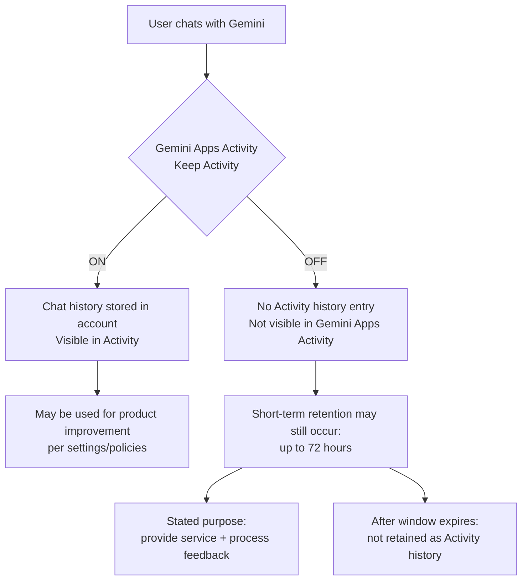

# Gemini: "Keep Activity OFF" Still Means Up to 72-Hour Retention (Invisible in Activity)

This repo documents, using official Google documentation, that turning **Gemini Apps Activity (Keep Activity)** OFF
may still allow conversations to be saved for **up to 72 hours**, and that this short-term retention **does not appear**
in Gemini Apps Activity (i.e., it is not user-visible).

---

## Key Points

- Keep Activity **OFF** ≠ immediate zero retention
- Conversations may be saved for **up to 72 hours**
- This short-term retention **won't appear in Gemini Apps Activity**
- The stated purpose is to provide the service and process feedback

### Primary Sources

- **Manage & delete your Gemini Apps activity (Android)**
  https://support.google.com/gemini/answer/13278892?hl=en

- **Google Workspace Updates Blog**
  https://workspaceupdates.googleblog.com/2025/05/pre-configure-the-gemini-app-conversation-history-admin-setting.html

---

## Why People Care

| Concern | Detail |
|---------|--------|
| **Expectation gap** | "Training OFF" is commonly understood as "not saved" |
| **Transparency** | Short-term retention is not visible in Activity — users cannot audit it |
| **Weak alternatives** | Privacy-first users lose convenient history features |

---

## Practical Guidance

- **Do not paste secrets** — PII, credentials, API keys, customer data, unpublished plans
- **Turn Keep Activity OFF** (expect reduced history convenience)
- **Understand that up to 72 hours of retention may still occur**
- If you need history, prefer **local archiving** (notes / Markdown)
- Consider **Workspace / Cloud data governance** if applicable (consumer vs enterprise differs)

### References (Enterprise)

- Workspace privacy hub:
  https://support.google.com/a/answer/15706919?hl=en
- Gemini for Google Cloud data governance:
  https://docs.cloud.google.com/gemini/docs/discover/data-governance

---

## The Bigger Picture: Platform Power

- **Information asymmetry** — Enterprises use Workspace with stronger privacy guarantees; individual users are left with weaker consumer terms
- **Search dominance** — Critical articles about Google may face disadvantages in Google Search (EU antitrust precedent exists)
- **The case for alternatives** — Just as Brave protects users at the browser level, an AI privacy layer is increasingly needed

---

## Disclaimer

This repository summarizes publicly available official information and provides practical guidance for end users.
It is not legal advice. Information is current as of February 2026.

---

## License

[CC BY 4.0](LICENSE) — Free to share and adapt with attribution.
