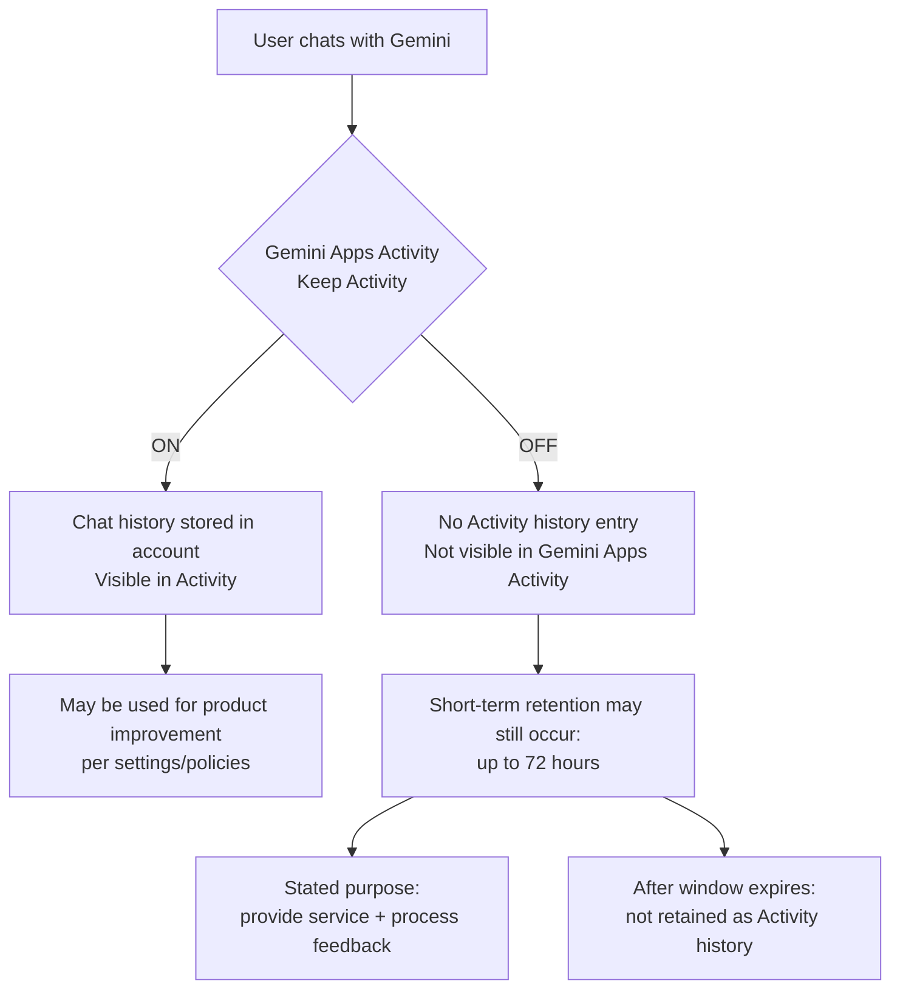

# Gemini: "Keep Activity OFF" Still Means Up to 72-Hour Retention (Invisible in Activity)

> **[日本語版はこちら / Japanese version](README.ja.md)**

This repo documents, using official Google documentation, that turning **Gemini Apps Activity (Keep Activity)** OFF
may still allow conversations to be saved for **up to 72 hours**, and that this short-term retention **does not appear**
in Gemini Apps Activity (i.e., it is not user-visible).

This is not a hack, not a conspiracy theory — just a careful reading of what Google has already published.

---

## Key Points

- Keep Activity **OFF** ≠ immediate zero retention
- Conversations may be saved for **up to 72 hours**
- This short-term retention **won't appear in Gemini Apps Activity**
- The stated purpose is to provide the service and process feedback

### Primary Sources

| Source | Key Quote |
|--------|-----------|
| [Manage & delete your Gemini Apps activity](https://support.google.com/gemini/answer/13278892?hl=en) | "Even when Keep Activity is off, ... saved ... up to 72 hours ... won't appear in your Gemini Apps Activity." |
| [Google Workspace Updates Blog](https://workspaceupdates.googleblog.com/2025/05/pre-configure-the-gemini-app-conversation-history-admin-setting.html) | Conversation history OFF still allows up to 72-hour retention, not shown in Activity |

---

## Why People Care

| Concern | Detail |
|---------|--------|
| **Expectation gap** | "Training OFF" is commonly understood as "not saved at all" |
| **Transparency** | Short-term retention is not visible in Activity — users cannot audit it |
| **Weak alternatives** | Privacy-first users must sacrifice convenient history features |
| **Consumer vs Enterprise** | Workspace/Cloud users get stronger privacy guarantees; individual users do not |

---

## GDPR and EU Relevance

This issue is particularly significant in the EU context:

- **GDPR Article 13/14** requires transparent disclosure of data processing purposes and retention periods. "Invisible retention" that doesn't appear in user-facing activity logs raises questions about whether users are adequately informed.
- **GDPR Article 17 (Right to Erasure)** — if data is retained for up to 72 hours after the user turns off activity tracking, the practical ability to exercise deletion rights is delayed.
- **EU antitrust precedent** — the European Commission has previously fined Google for self-preferencing in search results. The structural concern that critical information about Google's own services may be harder to find via Google Search is not hypothetical.

> This repository does not make legal claims. It highlights publicly documented facts that EU residents and regulators may find relevant.

---

## Practical Guidance

- [ ] **Do not paste secrets** — PII, credentials, API keys, customer data, unpublished plans
- [ ] **Turn Keep Activity OFF** (expect reduced history convenience)
- [ ] **Understand that up to 72 hours of retention may still occur**
- [ ] If you need history, prefer **local archiving** (notes / Markdown)
- [ ] Consider **Workspace / Cloud data governance** if applicable

### References (Enterprise)

- [Workspace privacy hub](https://support.google.com/a/answer/15706919?hl=en) — prompts not used for out-of-domain model training
- [Gemini for Google Cloud data governance](https://docs.cloud.google.com/gemini/docs/discover/data-governance) — prompts/responses not used for training

---

## Documentation

| File | Description |
|------|-------------|
| [`docs/checklist.md`](docs/checklist.md) | Privacy settings checklist |
| [`docs/faq.md`](docs/faq.md) | Frequently asked questions |
| [`docs/claims.md`](docs/claims.md) | Facts vs opinions (clearly separated) |
| [`docs/diagram.mmd`](docs/diagram.mmd) | Mermaid diagram source |
| [`README.ja.md`](README.ja.md) | Japanese version |

---

## The Bigger Picture: Platform Power

- **Information asymmetry** — Enterprises use Workspace with stronger privacy guarantees; individual users are left with weaker consumer terms
- **Search dominance** — Critical articles about Google may face disadvantages in Google Search (EU antitrust precedent exists)
- **The case for alternatives** — Just as [Brave](https://brave.com/) protects users at the browser level, an AI privacy layer is increasingly needed

---

## Disclaimer

This repository summarizes publicly available official information and provides practical guidance for end users.
It is not legal advice. Information is current as of February 2026.

---

## License

[CC BY 4.0](LICENSE) — Free to share and adapt with attribution.
