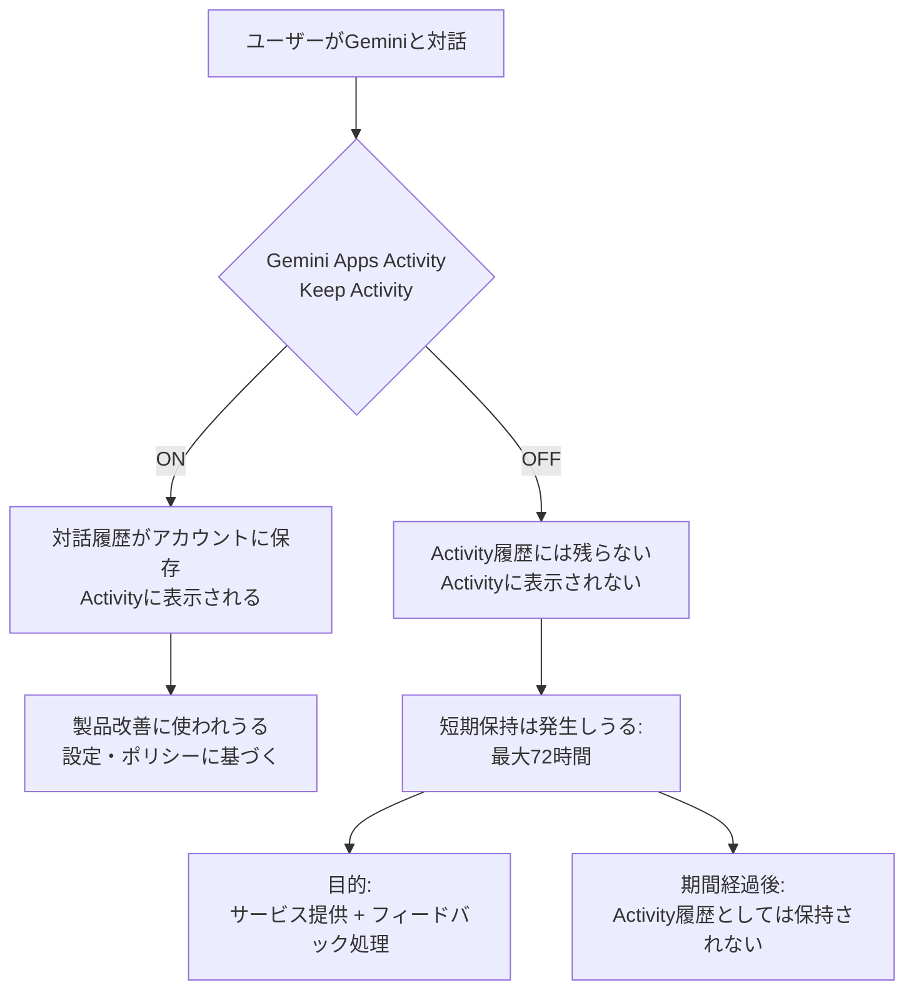

# Gemini「学習オフ」でも最大72時間保存される件（見えない保持の可視化）

このリポジトリは、Google Gemini の設定「Gemini Apps Activity（Keep Activity）」をオフにしても、
会話が **最大72時間** アカウントに保存され得ること、さらにその短期保存が **Gemini Apps Activity に表示されない**
（ユーザー側から見えない）ことを、公式ドキュメントに基づいて整理し、ユーザーが自衛できるようにするための資料です。

---

## 重要ポイント（結論）

- Keep Activity を **OFF** にしても、会話は **最大72時間** 保存され得る
- その短期保存は **Gemini Apps Activity に表示されない**（＝見えない保持）
- 目的は「サービス提供・フィードバック処理」のため、と説明されている

### 根拠（公式ソース）

- **Manage & delete your Gemini Apps activity (Android)**
  「Even when Keep Activity is off, ... saved ... up to 72 hours ... won't appear in your Gemini Apps Activity.」
  https://support.google.com/gemini/answer/13278892?hl=en

- **Google Workspace Updates Blog**
  「conversation history OFFでも up to 72 hours 保存、Activityに出ない」
  https://workspaceupdates.googleblog.com/2025/05/pre-configure-the-gemini-app-conversation-history-admin-setting.html

---

## なぜこれが問題になりやすいか

この仕様自体に Google 側の「理由」が用意されている一方で、ユーザー視点では誤解が生まれやすい構造になっています。

| 論点 | 内容 |
|------|------|
| **期待値ギャップ** | 「学習オフ＝保存しない」と受け取るのが自然。実際は最大72時間保持 |
| **透明性の欠如** | 短期保存が Activity に表示されず、ユーザーが監査できない |
| **代替の弱さ** | プライバシー優先にすると履歴機能を捨てることになる |

> **"学習オフ"という言葉から一般人が期待するのは「保存しない」。
> しかし実際は72時間保存され、しかも見えない。
> これは透明性と期待値設計の問題である。**

---

## ユーザー向け：最短の対策ガイド

このリポジトリは「叩き」ではなく「自衛」のための実用資料です。

### やるべきこと

- [ ] **重要情報を入力しない** — パスワード・APIキー・秘密鍵・顧客情報・未公開の設計/収益計画
- [ ] **Keep Activity を OFF にする**（履歴の利便性は落ちる）
- [ ] **OFFでも最大72時間保存される点を理解しておく**
- [ ] 履歴が必要なら **ローカル保存**（Markdown / ノートアプリ等）で運用する
- [ ] 可能なら **業務向け（Workspace / Cloud）** のデータ取扱いを検討する

### 参考：業務向けの扱い（消費者向けと前提が異なる）

- Workspace 管理者向けプライバシー（プロンプトがドメイン外学習に使われない旨）
  https://support.google.com/a/answer/15706919?hl=en
- Gemini for Google Cloud data governance（プロンプト/応答を学習に使わない旨）
  https://docs.cloud.google.com/gemini/docs/discover/data-governance

---

## ドキュメント

| ファイル | 内容 |
|----------|------|
| [`docs/checklist.md`](docs/checklist.md) | 設定確認・運用チェックリスト |
| [`docs/faq.md`](docs/faq.md) | よくある疑問（「嘘なの？」等） |
| [`docs/claims.md`](docs/claims.md) | 主張（意見）と事実の線引き |
| [`docs/diagram.mmd`](docs/diagram.mmd) | 仕様の関係図（Mermaid） |
| [`README.en.md`](README.en.md) | English version |

---

## 背景：プラットフォーム支配の構造問題

この問題は単なる「設定の話」にとどまりません。

- **情報の非対称性** — 企業やITリテラシーの高い層は Workspace を使い、一般ユーザーは消費者向けプランで不利な条件に晒される
- **検索の独占** — この種の批判記事が Google 検索で上位に来にくい可能性がある（EUでは Google の自社サービス優遇に対して独占禁止法の制裁実績あり）
- **代替ブラウザの存在意義** — Brave が広告ブロックでユーザーを守ったように、AIプライバシーを守る層が求められている

---

## 免責

本リポジトリは、公開されている公式情報の要約と、一般ユーザー向けの実用ガイドです。
法的助言ではありません。情報は 2026年2月時点のものです。

---

## ライセンス

[CC BY 4.0](LICENSE) — 引用・共有・改変自由（クレジット表記あり）
